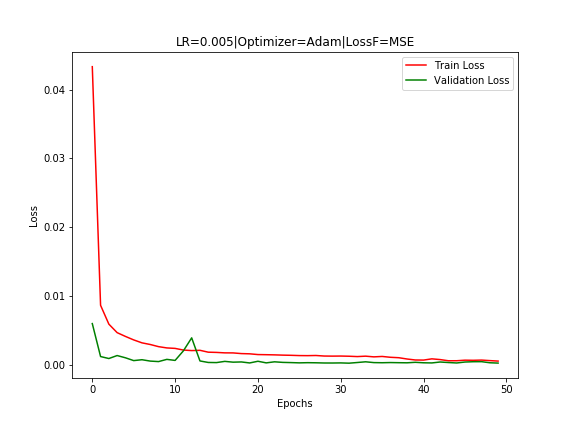
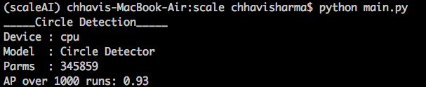

## CNN Circle Detection
Circle detection in noisy images using CNNs

## Execution Instructions
  - Training:
      - Google Colab 
          -Run the google colab [ipynb notebook](ScaleAI_ChhaviSharma.ipynb) to execute cells in order.

  - Testing:
      - Environment:(tested using conda on MacOSX)
         ```
            python == 3.6
            pytorch == 1.4.0
            Shapely == 1.6.4.post2
            matplotlib == 2.2.2
            numpy == 1.14.3
            scikit_image == 0.13.1
         ```
      - Run <python main.py> to test
    

## Implementaiton Details

#### Assumptions:
These assumptions are made to just scope out the problem:

- *There is only one circle per image:*

  The model architecture can be easily modified to accound for multiple circles. This could be something like a Region Proposal Network to reduce the search space and then further regress and classifiy over the selected candiate object regions, ( like FRCNN).

- *Each image has a circle:*

  There is no objectness parameter being trained currently that indicates the presence of a circle in the image, since the assumention (in accordance with the provided problem setup) is that each image has a circle and some random noise. 
  

#### Approaches Considered:
1. Classicial (pre-deep learning)
    - Noise reduction using gaussian kernels
    - Edge detection using derivative filters
    - Thresholding for feature extaction
    - Erosion, dialtion and estimation of blobs (connected components)
    - Radius and center estimation using bounding boxes
 
2. CNN based detector (implemented)
    - Architecture: Cascaded units of stacked Convolution layer, Batchnorm layer, Relu Activation and Pooling, with the final spatial dimension reduction to 1x1, and, channel dimension reduction to 3 (row col, rad). Finally the output of (Batch, Channels, Height, Width) -> (N,3,1,1) is converted to a probabiltiy using the sigmoid layer.
    - No fully connected layer is used and spatial order is maintained.
    - Each prediction, i.e. row, col and radius are regressed on individually.
    - Loss = (Y - Yhat)^2 (MSE) where Y = (row/200.0, col/200.0, rad/50.) and Yhat is the corresponding 3d vector prediction.        
      The model predicts (row, col, radius) relative lengths with respect to predefined max length
      ie. predicton = (row/200.0, col/200.0, radius/50.0)
    - Predictions are convereted to absolute lengths before evlautation
    
#### Data:
  Collected image samples of dims [1,200,200] for training(20k) and validation(4k) (80-20)

#### Training Configuration:
  num_epochs    = 50
  criterion     = MSE Loss 
  learning_rate = 5e-3
  optimizer     = torch.optim.Adam(model.parameters(), lr=learning_rate)

#### Training and Evaluation:
  Validation is computed after eaach epoch and the loss is plotted in the following graph.
  
  Learning Curve -
  
  
  Finally the model is tesed by running ```python main.py``` or the main method in ipynb. 
  <p align="center">
    
  </p>

    
